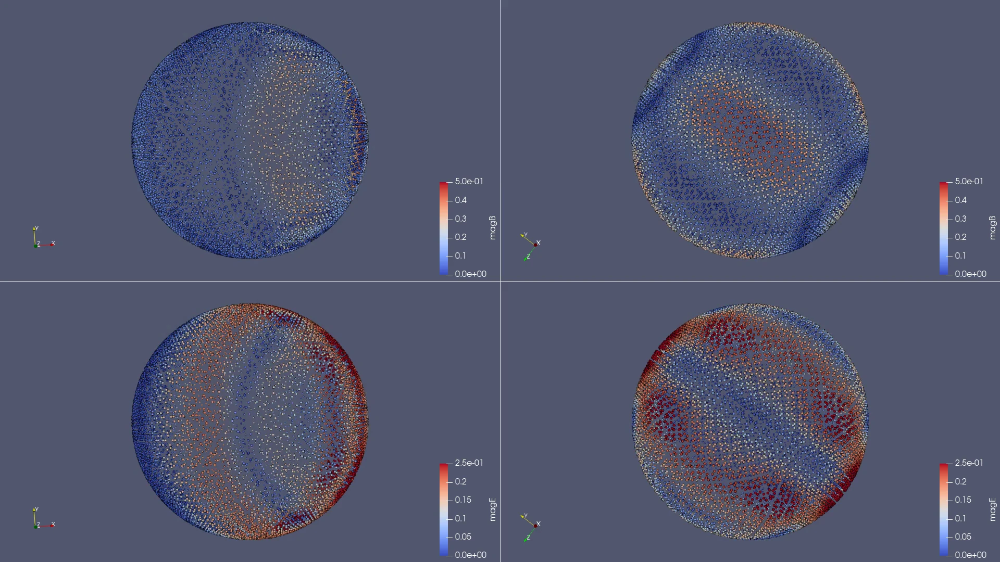

# Visualization with ParaView {#ReadCSVParaView}
\brief Scripts for use in ParaView.

In order to display the field exported with [Exporter](@ref Manicore::Exporter) in ParaView, 
import the csv file with the "CSV Reader" reader in ParaView,
then add a ProgrammableFilter.
The output of the filter must be "vtkPolyData" (and **NOT** "same as input"), and the following scripts may be used:
- For scalar valued field
```python
from vtk.numpy_interface import algorithms as algs
from vtk.numpy_interface import dataset_adapter as dsa
data = inputs[0].GetRowData()
coordinates = algs.make_vector(data.GetArray('X'),data.GetArray('Y'),data.GetArray('Z'))
pts = vtk.vtkPoints()
pts.SetData(dsa.numpyTovtkDataArray(coordinates, "Points"))
output.SetPoints(pts)
output.PointData.append(data.GetArray("Val"), "Val")
```
- For vector valued field
```python
from vtk.numpy_interface import algorithms as algs
from vtk.numpy_interface import dataset_adapter as dsa
data = inputs[0].GetRowData()
coordinates = algs.make_vector(data.GetArray('X'),data.GetArray('Y'),data.GetArray('Z'))
pts = vtk.vtkPoints()
pts.SetData(dsa.numpyTovtkDataArray(coordinates, "Points"))
output.SetPoints(pts)
output.PointData.append(make_vector(data.GetArray("ValX"),data.GetArray("ValY"),data.GetArray("ValZ")), "Val")
```



