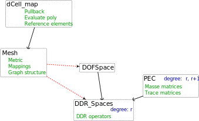

# Manicore

Manicore - Library to implement schemes on n-dimensional manifolds.

The sources are available at https://github.com/mlhanot/Manicore.

This library stem from the HArD::Core library (https://github.com/jdroniou/HArDCore) and the generalization of the Polytopal Exterior Calculus (https://doi.org/10.48550/arXiv.2303.11093) to manifolds with general Riemannian metric.
The name come from Manifold and HArDCore.

\tableofcontents

You will find on this page the following sections:
- [Build instructions](#Build)
- [Mesh description](#Mesh_Format)
- [Usage of the library](#Usage)
- [Additional information](#Guides)


\section Build

\subsection Dependency

The project uses a fairly minimal set of dependency. 
The only one required to compile the code is [Eigen library](http://eigen.tuxfamily.org/) version 3.4 or later. 
This is the version available on Debian Bookworm (Debian 12), where it can be installed by running 
```
sudo apt install libeigen3-dev
```
This is an header only library and it can also be installed extracting the sources anywhere CMake can find them. 

Internally, Manicore also uses the [json library from nlohmann](https://github.com/nlohmann/json), 
quadrature rules from John Burkardt and various functions from the [HArDCore library](https://github.com/jdroniou/HArDCore).
However, these dependency are copied into this repository and do not need to be installed individually.

A recent compiler with support for c++20 is also required to compile the library.

\subsection Building 

Once the dependency is installed, this library can be build running the following from the repository root:

```
mkdir build
cd build
cmake ..
make
```

To use the library, some component of the mesh must also be compiled as a shared library. 
This can be done independently and will be linked at runtime.

\subsection Configuration

Although the current version only support the dimension 2,
the library aimed to be usable in any dimension. 
The target dimension is set at compile time by the macro *MAX_DIMENSION*. 
It should be sufficient on ulterior version, 
but for now one must also provide quadrature rules, a support for the triangulation and adapt the mesh interface.

It is possible to build the test case enabling the option *BUILD_TEST* in CMake.
This can be used to verify the installation and gives some examples on the usage. 

The type of build (Release; RelWithDebInfo; Debug; Debugall) can be set in CMake. It defaults to Release. 

\section Mesh_Format Mesh Format 

In a flat space, we can describe a mesh using only the location of the vertices and the topological data.
In general, we must also specify the shape of each cell.

In Manicore, the [mesh](@ref MeshFormat) is given in two parts: 
1. A [json file](./mesh_format) giving the topological information.
2. A [shared library](@ref map_interface.hpp) giving the geometrical information with user defined functions.

To ease the description of the geometrical data, one can include some parameters to the json file that will be passed to the functions of the shared library.
This allows to reuse the same code for several cells.

The manifold is viewed through an atlas, and the cells are always mapped to a chart of this atlas. 
For the flat cell, the library can generate the mapping by itself. However, it must be provided in the shared library for the curved cells. 

\subsection topdata Topological data

The format for the json file is described [here](./mesh_format).
The top level fields are:
- Map
- Dimension
- Cells

The field *Map* serves to describe the atlas. It contains:
- *Outer_dimension*: An embedding into \f$\mathbb{R}^n\f$ may be provided for visualization purpose. This field gives the number \f$n\f$. 
This is optional and not used for computation.
- *Arguments*: If the embedding is used, extra arguments that will be passed to the embedding function can be specified here.
- *Arguments_metric*: This allows to pass extra arguments to the functions giving the metric on each chart.

Even if the extra arguments are not mandatory, there are used to determined the number of charts. 
Moreover, the charts are implicitly indexed by their order of appearance in this array.
If extra arguments are not needed for some chart, pass 'null' instead of nothing.

The field *Dimension* is just a number. It is the intrinsic dimension of the manifold (e.g. 2 for a sphere in \f$\mathbb{R}^3\f$).

The field *Cells* describe the mesh. It is an array of array of cell. The n-th element of *Cell* is the list of (n-1)-cells.
The description of 0-cells (or vertices) is different, it contains only two informations:
- *Map_ids*: The list of chart containing this vertex.
- *Location*: The location of the vertex in each chart.

The description of n-cells (n > 0) contains:
- *Map_ids*: The list of chart containing this cell.
- *Mappings*: The index of the parametrization from the reference element to the corresponding chart. It must match the user-defined index in the shared library. If the cell is flat, use the special value 0 to automatically generate the mapping.
- *Mappings_extra_args*: Extra arguments passed to the mapping functions. Use 'null' if not needed.
- *Pullback_extra_args*: Extra arguments passed to the differential of the mappings. If 'null', it will instead use the arguments from *Mappings_extra_args*.
- *Ref_elem*: Reference element. It is given as a list of simplexes. It is shared between all mappings. It can be generated automatically if the field is null and the mapping is flat.
- *Boundary*: List the (n-1)-cells composing the boundary of this cell. The indices of the (n-1)-cells is their order of appearance in this list.

As for the chart, the cells are implicitly indexed by there order of appearance in the array.
To summarize, the indices are generated as follows:
- Embedding and (metric on) charts: Defined in the shared library but must match the order of arguments in the *Map* field of the json. 
Index starts at 0.
- Cells: Order of appearance in the json file. Index starts at 0.
- Cell maps: Defined in the shared library. It is not associated to an internal index, but the code assumes that 0 is reserved for the flat map. Index starts at 1.

An element is *flat* if its *Mappings* is `[0]` and it boundary is also flat.
To implement more efficiently the flat elements, it is required that a flat element belongs to a single chart.
If an element if flat in several charts, then a trivial mapping must be manually implemented.

\subsection geodata Geometrical data

The interface for the shared library is given [here](@ref map_interface.hpp). See also [here](@ref MeshFormat) for related functions.
The code given in the library will be executed without any check or security measure.

The main interface is a function, taking an index as argument and returning the appropriate structure.
It will usually be a simple switch statement.
The structures are described [here](@ref definitions.hpp). 
The <em>_extra</em> member is set at runtime from the data in the json file and allows to parametrize the functions. 

There is three types of function to implement in the library:
- The embedding. It is optional and not directly called in the code, simply return a [nullptr](@ref Manicore::DefaultMapping) if not needed.
- The metric on each chart. The [metric](@ref Manicore::ParametrizedMetricMap::metric) must return the metric matrix on the tangent space. 
While the metric on the cotangent space [metric_inv](@ref Manicore::ParametrizedMetricMap::metric_inv) and the volume form [volume](@ref Manicore::ParametrizedMetricMap::volume) 
can be derived from the metric, for efficiency reason their computation is left to the user. 
Simply use the builtin inverse and determinant method from Eigen if no expression is known.
- The parametrization of each type of cell. It must implement the parametrization from the reference element to a chart [I](@ref Manicore::ParametrizedMap::I) and its right inverse [J](@ref Manicore::ParametrizedMap::J).
The derivative of both map must also be implemented in another structure [DI](@ref Manicore::ParametrizedDerivedMap::DI) and [DJ](@ref Manicore::ParametrizedDerivedMap::DJ).

\section Usage 

For now, there is three main classes in the library:
- The [mesh](@ref Manicore::Mesh) class allowing to manipulate the mesh. It is not constructed directly but through the [mesh_builder](@ref Manicore::Mesh_builder).
- The [PEC](@ref Manicore::PEC) class allowing to compute integral and traces on the mesh.
- The [DDR_Spaces](@ref Manicore::DDR_Spaces) class implementing the operators of the Polytopal Discrete De Rham complex.

To use the [DDR](@ref DDR) construction in a scheme, the setup takes only a few line:
\code{.cpp}
  // Build the mesh, meshfile is the path to the json file, mapfile is the path to the shared library (must be already compiled)
  std::unique_ptr<Mesh<dimension>> mesh_ptr(Mesh_builder<dimension>::build(meshfile,mapfile));
  // Polynomial degree
  int r = 3;
  // Build the DDR spaces, the PEC class is initialized and used internally
  DDR_Spaces<dimension> ddr_spaces(*mesh_ptr,r);
\endcode
The operator can then be used directly. For example, to compute the differential of an interpolate, one can do: 
\code{.cpp}
  // Compute the interpolate of a k form F
  Eigen::VectorXd interp = ddr_spaces.template interpolate<k>(F);
  // d the dimension of the cell, iT the index of the cell
  ddr_spaces.full_diff(k,d,iT)*ddr_spaces.dofspace(k).restrict(d,iT,interp);
\endcode

The various available components are summarized in the following diagram:



\section Guides Additional information

- Some sample scripts to read the csv files generated by [Exporter](@ref Manicore::Exporter) in ParaView are available [here](@ref ReadCSVParaView).

